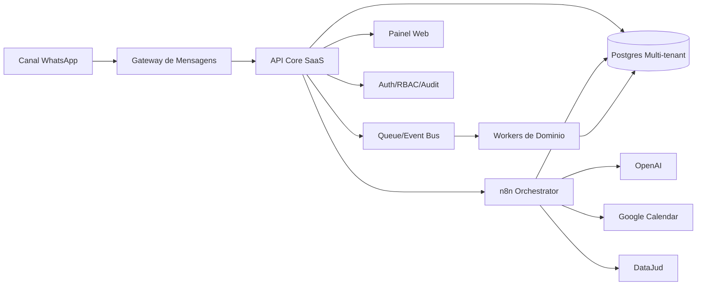

# Arquitetura SaaS Juridico - Base de Produto

## 1) Por que criar

### Contexto atual
- O bot ja gera valor real no atendimento.
- O escritorio ja possui fluxo operacional em producao (n8n + Postgres + OpenAI + Calendar + DataJud).
- Existem dores recorrentes de confiabilidade em operacoes criticas (agendamento, mensagens erradas, inconsistencias).

### Tese
Criar um SaaS permite transformar automacoes internas em um produto:
- repetivel para varios escritorios,
- previsivel em operacoes sensiveis,
- auditavel para uso juridico,
- escalavel com receita recorrente.

## 2) Para que criar

### Objetivo de negocio
- Construir uma plataforma de atendimento juridico com IA e operacao assistida.
- Monetizar por assinatura mensal por escritorio e por volume.

### Objetivo de produto
- Reduzir falhas operacionais.
- Aumentar velocidade de resposta.
- Preservar contexto de cliente/processo.
- Dar visibilidade gerencial para socios/gestores.

## 3) Problemas que o SaaS precisa resolver

1. Falha de confiabilidade em operacoes criticas.
2. Falta de padrao de atendimento entre canais e equipes.
3. Perda de contexto entre conversas.
4. Dificuldade de auditoria (quem fez o que, quando, por qual regra).
5. Ausencia de metricas consolidadas de qualidade e resultado.
6. Dependencia de conhecimento tecnico para ajustar fluxos.

## 4) O que o sistema deve ser

### Resultado esperado
- Plataforma multi-tenant para escritorios juridicos.
- CRM juridico + Atendimento IA + Agenda segura + Integracoes processuais.
- Camada de automacao com n8n controlada por regras de negocio.

### Principios
- Multi-tenant desde o dia 1.
- Seguranca e LGPD por padrao.
- Operacoes criticas deterministicas (nao deixar decisao somente no LLM).
- Eventos auditaveis e rastreaveis.
- Arquitetura modular, com inicio simples e evolucao planejada.

## 5) Escopo funcional (MVP -> v2)

### MVP
1. Gestao de clientes e casos (CRM juridico basico).
2. Inbox omnichannel (inicialmente WhatsApp).
3. Assistente IA com memoria por cliente.
4. Agenda com confirmacao em 2 etapas.
5. Resumo automatico de atendimento.
6. Dashboard operacional (falhas, conversoes, tempo medio, duplicidades).

### V2
1. Pipeline comercial e financeiro.
2. Portal do cliente.
3. SLA e roteamento por equipe.
4. Integracoes com ERPs/SaaS juridicos externos.
5. Copiloto interno para equipe juridica.

## 6) Arquitetura proposta (high-level)

## 7) Componentes e responsabilidades

### 7.1 API Core SaaS
- Fonte de verdade de regras de negocio.
- Exposicao de API para painel, integracoes e canal.
- Controle de tenant, autorizacao, quotas e billing hooks.

### 7.2 n8n Orchestrator
- Orquestracao de fluxos de automacao e IA.
- Integracoes externas (OpenAI, Calendar, DataJud, etc).
- Nao guarda regra critica isoladamente: regras centrais ficam no Core.

### 7.3 Postgres Multi-tenant
- Dados transacionais e auditoria.
- Estrategia recomendada no inicio: coluna `tenant_id` em todas as tabelas.
- RLS por tenant quando necessario.

### 7.4 Queue/Event Bus
- Desacoplamento de tarefas assincronas.
- Retentativa, DLQ e resiliencia operacional.

### 7.5 Workers
- Processamento assincrono (resumos, consolidacoes, sincronizacoes, webhooks).

### 7.6 Painel Web
- Operacao do escritorio: inbox, clientes, agenda, indicadores, configuracoes.

## 8) Modelo de dominio inicial

### Entidades principais
- `tenant`
- `user`
- `contact`
- `case`
- `conversation`
- `message`
- `appointment`
- `workflow_run`
- `audit_event`
- `integration_account`

### Relacoes chave
- `tenant 1:N users`
- `tenant 1:N contacts`
- `contact 1:N conversations`
- `conversation 1:N messages`
- `contact 1:N appointments`
- `tenant 1:N audit_events`

## 9) Seguranca, LGPD e auditoria

### Requisitos obrigatorios
- Criptografia em transito e em repouso.
- Controle de acesso por papel (RBAC).
- Mascaramento/sanitizacao de PII em logs tecnicos.
- Politica de retencao por tipo de dado.
- Trilhas de auditoria para operacoes criticas.
- Base legal e consentimento por tenant quando aplicavel.

### Politicas minimas
- Retencao configuravel por tenant.
- Exportacao e eliminacao de dados sob demanda (direitos do titular).
- Segregacao logica de dados entre escritorios.

## 10) Observabilidade e operacao

### Telemetria
- Logs estruturados por `tenant_id`, `conversation_id`, `workflow_id`.
- Metricas: sucesso/erro, latencia, retentativas, uso por modulo.
- Tracing em operacoes criticas (agenda, envio, integracoes).

### SLO inicial
- Disponibilidade API >= 99.5%
- Sucesso de envio de mensagens >= 99%
- Falha de agendamento < 1%

## 11) Decisoes arquiteturais iniciais

1. Comecar com monolito modular no Core (mais rapido para MVP).
2. Manter n8n como camada de orquestracao e integracao.
3. Isolar regras criticas no Core + fluxos deterministicos.
4. Adotar event-driven apenas para tarefas assincronas.
5. Garantir multi-tenant antes de escala comercial.

## 12) Roadmap de implementacao

### Fase 0 - Fundacao (1-2 semanas)
- Definir dominio e contratos de API.
- Definir padrao de tenant, auth, auditoria.
- Definir padrao de eventos e filas.

### Fase 1 - MVP interno (3-5 semanas)
- CRM basico + Inbox + Agenda segura + Resumo IA.
- Dashboard operacional minimo.
- Publicar ambiente de homologacao.

### Fase 2 - Beta com clientes reais (4-8 semanas)
- Onboarding de 2-5 escritorios piloto.
- Coleta de metricas de uso e erro.
- Ajustes de UX e confiabilidade.

### Fase 3 - Escala comercial
- Billing, planos, limites, suporte.
- Hardening de seguranca e compliance.
- Expansao de canais e integracoes.

## 13) KPI de produto e negocio

### Produto
- Taxa de erro operacional por 1000 mensagens.
- Tempo medio de primeira resposta.
- Taxa de conclusao de agendamentos.
- % de atendimentos com resumo salvo.

### Negocio
- MRR por tenant.
- Churn mensal.
- CAC payback.
- NPS por escritorio.

## 14) Riscos e mitigacoes

1. Excesso de dependencia em automacao sem governanca.
   - Mitigacao: regras criticas no Core + auditoria + fallback humano.
2. Complexidade prematura de arquitetura.
   - Mitigacao: monolito modular e evolucao por necessidade real.
3. Risco LGPD/compliance.
   - Mitigacao: privacy by design + politicas claras + trilhas de auditoria.
4. Variacao de processos entre escritorios.
   - Mitigacao: configuracao por tenant e templates operacionais.

## 15) Definicao de pronto para comecar a construir

Podemos iniciar implementacao quando estes itens estiverem fechados:
1. ICP e posicionamento do produto.
2. Escopo fechado do MVP.
3. Modelo multi-tenant validado.
4. Contratos de API principais definidos.
5. Politicas de seguranca/LGPD aprovadas.
6. Metricas de sucesso e metas trimestrais definidas.

