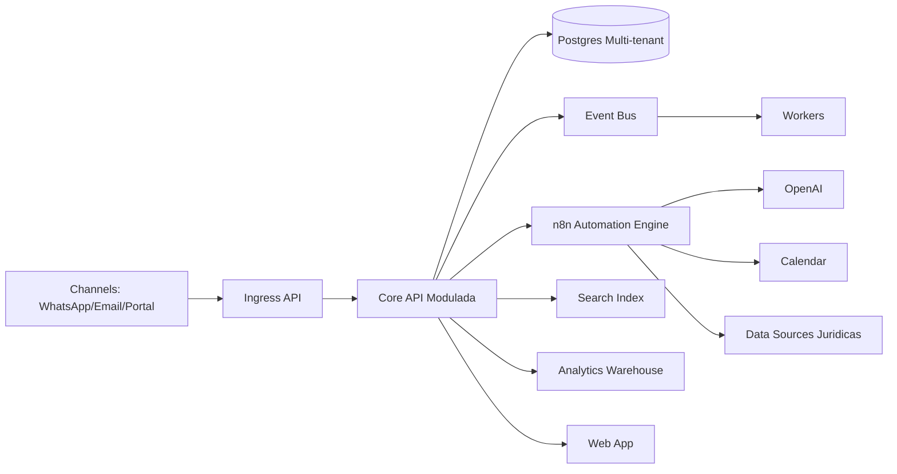

# Estrutura SaaS Competitivo para Escritorios de Advocacia

## 1) Tese de produto (nao so "mais um software juridico")

### Categoria proposta
Legal Operations and Client Experience Platform (Law Firm OS).

### Tese central
O mercado ja tem boas suites de gestao juridica. O diferencial competitivo real em 2026 nao e "ter IA", e sim:
- transformar IA em acoes confiaveis,
- conectar atendimento -> operacao juridica -> financeiro -> relacionamento,
- entregar previsibilidade de resultado por area de pratica.

## 2) O que o mercado ja oferece (baseline que precisa bater)

### Referencias observadas
1. Clio evoluiu para plataforma de "intelligent legal work", com IA em operacoes completas (agendamento, comunicacao, billing) e nao apenas texto.
2. MyCase posiciona suite fim a fim (intake, case, billing, pagamentos, portal) e amplia IA de assistentes e interface conversacional.
3. Aurum (Astrea/Themis) enfatiza centralizacao de processos, prazos, documentos, tarefas, automacoes e Kanban para escritorio e corporativo.
4. Projuris destaca IA aplicada a contratos (sumarizacao, clausulas, automacao de variaveis, assistente conversacional).
5. ADVBOX destaca agentes juridicos especializados no Direito brasileiro e foco em produtividade da rotina.

### Implicacao estrategica
Para ser competitivo, seu produto precisa:
- ser suite completa,
- ter IA nativa e segura,
- e apresentar um diferencial claro de confiabilidade + performance de negocio.

## 3) Estrutura recomendada de produto (12 modulos)

## M1) Core Platform
- Multi-tenant, RBAC, auditoria, configuracoes por escritorio, faturamento SaaS.

## M2) CRM Juridico
- Leads, contatos, casos, historico, estagio comercial e juridico.

## M3) Omnichannel Inbox
- WhatsApp (primeiro), email e portal.
- Timeline unica por cliente/caso.

## M4) AI Atendimento
- Agente conversacional juridico com memoria por cliente.
- Resumo automatico e handoff para humano.

## M5) Case and Deadline Management
- Processos, prazos, audiencias, tarefas, responsaveis, alertas.

## M6) Agenda Segura
- Agendamento/cancelamento/remarcacao com confirmacao forte e trilha de auditoria.

## M7) Document and Knowledge
- Templates, automacao documental, versionamento, biblioteca interna.

## M8) Financial OS
- Honorarios, despesas, faturamento, recebimentos, inadimplencia, previsao de caixa.

## M9) Process Intelligence
- Integracao com andamentos/publicacoes e consolidacao por caso/tribunal.

## M10) Client Portal
- Acompanhamento do caso, documentos, mensagens, status e pagamentos.

## M11) Analytics and Benchmarks
- KPIs operacionais, comerciais e financeiros.
- Benchmark anonimo entre escritorio semelhante (feature premium futura).

## M12) Compliance and Governance
- LGPD, retencao, exportacao/exclusao de dados, logs e controles de seguranca.

## 4) Camada de diferenciacao (o que torna "diferente")

## D1) Reliability Layer para IA (seu maior diferencial)
- Operacoes criticas nao ficam 100% na decisao do LLM.
- Fluxos deterministicos para agenda, cobranca, promessas ao cliente e prazos.
- "AI suggests, system guarantees": IA sugere, regras de negocio garantem.

## D2) Closed Loop Atendimento -> Receita
- Tudo nasce no atendimento e termina em resultado mensuravel:
  - conversao de lead,
  - agendamento realizado,
  - contrato fechado,
  - fatura emitida e paga.

## D3) Playbooks por area de atuacao
- Familia, Trabalhista, Previdenciario, Civel etc.
- Cada playbook com checklist, templates, SLA e automacoes proprias.

## D4) Qualidade operacional orientada por dados
- Score de qualidade por atendimento.
- Alertas de risco (mensagem sem resposta, prazo sem responsavel, cliente propenso a churn).

## D5) IA juridica contextual e auditavel
- Respostas com contexto interno do escritorio.
- Trilhas: qual dado foi usado, qual regra aprovou, quem confirmou.

## 5) Arquitetura tecnica recomendada

### Papel do n8n nessa arquitetura
- Ferramenta de automacao e integracao.
- Nao e o produto inteiro.
- Regras criticas ficam no Core API (versionadas, testaveis e auditaveis).

## 6) Moat (barreira competitiva real)

1. Dados estruturados de operacao juridica + atendimento (historico de decisoes).
2. Playbooks proprietarios por area e perfil de escritorio.
3. Motor de confiabilidade (guardrails) com baixa taxa de erro em operacoes criticas.
4. Benchmark operacional anonimo de mercado (quando base crescer).
5. Rede de integracoes nativas (tribunais, financeiro, assinatura, comunicacao).

## 7) ICP e posicionamento comercial

### ICP inicial
- Escritorios pequenos e medios (5 a 50 pessoas) com alto volume de atendimento.

### Posicionamento
"O sistema operacional do escritorio que transforma atendimento em resultado juridico e financeiro, com IA confiavel."

## 8) Estrategia de precificacao (sugestao)

### Plano Base
- CRM + inbox + agenda + case management.

### Plano Pro
- IA atendimento, automacoes avancadas, dashboards.

### Plano Scale
- Playbooks multi-equipe, governanca avancada, SLA premium, benchmark.

### Add-ons
- Modulos especificos (contratos, portal, cobranca inteligente, analytics avancado).

## 9) Roadmap competitivo (90 dias)

## Bloco 1 (Dias 1-30)
- Core multi-tenant, inbox WhatsApp, CRM, agenda segura, auditoria.

## Bloco 2 (Dias 31-60)
- IA atendimento, resumo automatico, financeiro basico, dashboard operacional.

## Bloco 3 (Dias 61-90)
- Playbooks por area, portal cliente v1, qualidade operacional e alertas de risco.

## 10) Metricas para provar competitividade

1. Taxa de erro em operacoes criticas (meta: <1%).
2. Tempo medio de primeira resposta.
3. Taxa de agendamento concluido.
4. Taxa de conversao lead -> cliente.
5. DSO / prazo medio de recebimento.
6. NPS de cliente final e NPS interno da equipe.

## 11) Decisao estrategica recomendada

Nao vender "software juridico com IA".
Vender "plataforma de operacao juridica orientada a resultado", com:
- IA confiavel,
- governanca,
- e impacto direto em receita, produtividade e experiencia do cliente.

## Referencias de mercado usadas (acesso em 09/04/2026)
- Clio press: https://www.clio.com/about/press/clio-introduces-the-legal-industrys-first-intelligent-legal-work-platform/
- Clio Manage AI features: https://www.clio.com/features/legal-ai-software/
- ClioCon 2025 highlights: https://www.clio.com/blog/cliocon-2025-highlights/
- MyCase announcements: https://www.mycase.com/news/ai-accounting-immigration-product-updates/
- MyCase AI assistant: https://www.mycase.com/features/ai-case-assistant/
- Aurum (Astrea/Themis): https://www.aurum.com.br/
- Projuris Contratos: https://www.projuris.com.br/contratos/
- ADVBOX Agentes Juridicos: https://guia.advbox.com.br/agentes-de-ia/faq-agentes-juridicos-advbox
- Thomson Reuters Future of Professionals 2025: https://legal.thomsonreuters.com/content/dam/ewp-m/documents/thomsonreuters/en/pdf/reports/future-of-professionals-report-2025.pdf

